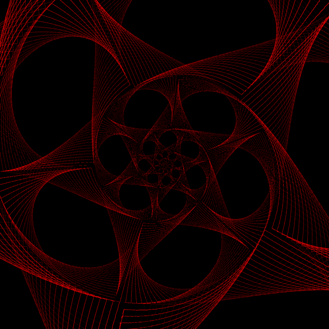

# Modular Modifier

## Description

Note: this tool is mostly superseded by an HTML5 version, [on my website](http://ianharmon.com/projects/modular-modifier/). Additionally, some of this documentation is outdated.

Modular Modifier is a Processing script that allows you to chain together procedural/glitch effects on an input image/GIF. The output depends on the order and settings of each effect. For example, you can split a GIF into RGB subframes, then apply a glitch effect to those subframes before putting the whole thing back together again. Or you can convert an image to ASCII then spiral-project it. Or you can palette-cycle a GIF and then slit-scan it. There are lots of possibilities!

*the previous image slit-scanned and JPEG-glitched:*

*a spiral-projected GIF:*

## Requirements

This script was tested on [Processing 3](https://www.processing.org/download/) and also requires the Processing 3 version of the gifAnimation library which can be downloaded [here](https://github.com/extrapixel/gif-animation/tree/3.0).

## Usage

At the top of the file, set `inputFilename` and `modifiers`. Examples for `modifiers` are commented out below it. Each modifier is an object that can be initialized with or without options, in the latter case defaults are used.

Frames will be saved to the folder in `framesFolder`, which generates a path from a list of a folder and subfolders.

You can also set `fps` to change the rate that the output frames are displayed, but this doesn't affect the actual output, since individual images are exported and should be assembled to GIF with something like ImageMagick, FFmpeg, or Photoshop.

To export the results, press any key while the output window is open.

## Frame Helper Details

### `FrameDuplicator`

When loading still images instead of GIFs, this can be used to generate more frames to work with.

#### Options

  * `count`: The number of output frames.

### `PixelScaler`

Scales input frames 2x, 3x, etc, without any smoothing.

#### Options

  * `scale`: The output scale.

### `Doubler`

Produces output frames with the input doubled, side-by-side.

### `Mirrorer`

Produces output frames with the input doubled, horizontally mirrored.

#### Options

  * `reverse`: Whether the mirroring should happen on the other side.

### `RgbSplitter`

Splits RGB1, RGB2, etc frames into R1, G1, B1, R2, G2, B2, etc.

### `RgbMerger`

Puts them back together.

### `HsbSplitter`

Same idea as `RgbSplitter`, but with Hue, Saturation, Brightness.

### `HsbMerger`

Puts them back together.

## Frame Modifier Details

### `Asciifyer`

Converts an image into ASCII art. Note 1: The fonts in /fonts will need to be installed first. Note 2: stores cached lookup tables in `~/Desktop/cache` in order to run faster.

#### Options

  * `longestSide`: How many characters across the output should be.
  * `drawBorder`: Adds a ASCII frame around the output.
  * `font`: Which font to use for the output. `cmd` and `c64` are valid options.
  * `colors`: Which color palette to use. `ansi` and `gameboy` are valid options.
  * `dontUseFirst`: Prevents the first palette color from being used as anything but background.
  * `dontUseFirst`: Lets all colors be backgrounds. Overrides `dontUseFirst`.
  * `noResize`: Uncommon usage, makes the conversion 1:1; 1 input pixel = 1 output character. **Warning:** be careful with the output size, don't use anything but small images with this option!

### `PaletteCycler`

Palette-cycles a frame based on brightness. The number of frames needs to be equal to the number of colors in the palette, which is 16.

#### Options

  * `steps`: How many brightness steps in the image the palette will cycle across.
  * `keepBlack`: Black pixels in the image remain black instead of being cycled.
  * `brightnessAdjust`: Adjusts the brightness of the entire image before applying the palette.

### `Polarizer`

Creates a polar projection of the input.

#### Options

  * `diameter`: Diameter of the output.
  * `fill`: Whether the output should fill the frame.
  * `invert`: Vertically flips the output before projecting.
  * `rotate`: Rotates the output by radians.

### `Spiralizer`

Creates a logarithmic spiral projection of the input.

#### Options

  * `diameter`: Diameter of the output.
  * `invert`: Vertically flips the output before projecting.
  * `spiralTightness`: How constrained the growth of the spiral should be. Good values are between 2-10, larger ones will take longer.
  * `stretch`: How much to horizontally stretch the input image when projecting.

### `BoxSwapper`

This repeatedly takes two random pieces of a frame and swaps them.

#### Options

  * `glitchPercent`: The chance that any given frame will have this effect applied.
  * `maxGlitches`: The maximum number of swaps that can happen.
  * `maxGlitchSize`: The maximum size of the pieces that are swapped.
  * `maxGlitchDistance`: The maximum distance between the pieces that are swapped.

### `JpegGlitcher`

Commonly known as the "notepad trick", this is the glitch effect you get when randomly removing chunks of a JPG's binary data. **On small input frames, this can error out.** Fixing that is a to-do.

#### Options

  * `glitchPercent`: The chance that any given frame will have this effect applied.
  * `maxCuts`: The maximum number of cuts that can happen.
  * `maxCutLength`: The maximum number of bytes each cut will remove.

### `SlitScanner`

Applies a slit-scan effect. Same idea as recording a plane propeller or other fast object with a cell phone camera.

#### Options

  * `vertical`: If `true`, the effect moves vertically instead of horizontally.
  * `reverse`: If `true`, the effect moves backward.
  * `stripsPerFrame`: The number of strips is based on this. No maximum, but the number of strips will never exceed the length of the dimension the effect moves along.
  * `useMask`: Uses a mask instead of scanning in a cardinal direction. You'll probably have to edit the source to use this.

### `PixelSorter`

This one needs to be revisited, and may not work like most pixel sorters.

#### Options

  * `threshold`
  * `smearFactor`
  * `smearIncrease`

### `RgbShuffler`

Shuffles RGB subframes between adjacent frames.

#### Options

  * `glitchPercent`: The chance that any given frame will have this effect applied.
  * `maxShuffleDistance`: The maximum frame distance a shuffle will take place between.

## To-do

  * make PaletteCycler allow any number of input frames
  * add additional PaletteCycler color palettes from my project Party Time
  * explain PixelSorter, RgbShuffler better
  * possibly rewrite PixelSorter
  * enforce RGB, R/G/B, H/S/B frame types for certain modifiers
  * possibly add better interface for setting the list of modifiers
  * additional cleanup and design

## Changelog

### 2016-04-04

  * added Spiralizer and PixelScaler

### 2016-03-13

  * revised modifier options method
  * added Asciifyer, PaletteCycler, and Doubler

### 2015-05-06

  * removed GIF export (quality was lacking) in favor of exporting frames
  * some code cleanup
  * wrote the readme

### 2014-11-14

  * initial modular/combined version of previous scripts

### 2014-11-03

  * slit-scan effect script was created ("GIF Slit-Scanner")

### 2014-10-23

  * pixel sorting script was created

### 2014-05-25

  * JPG corruption / subframe glitching script was created ("GIF Glitcher")