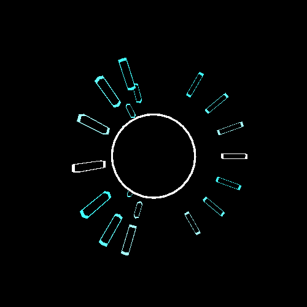
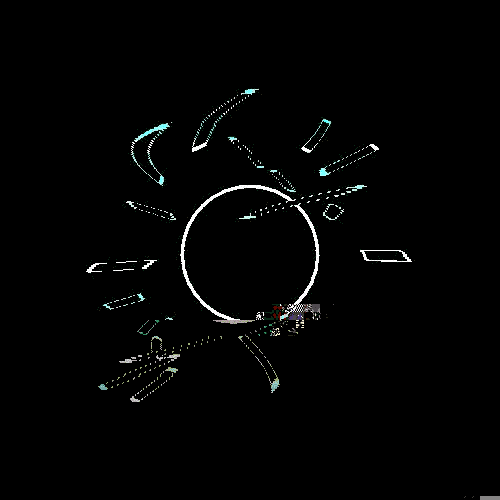

# Modular Modifier 

## Description

Modular Modifier is a Processing script that allows you to chain together glitch effects on an input image. The output depends on the order and settings of each effect. For example, you can split a GIF into RGB subframes, then apply a glitch effect to those subframes before putting the whole thing back together again.

 

## Requirements

This script was tested on [Processing 2.2.1](https://www.processing.org/download/) and also requires the [gifAnimation library](http://extrapixel.github.io/gif-animation/) which can be downloaded from within the Processing IDE.

## Usage

At the top of the file, set `inputFilename` and `modifiers`. Examples for `modifiers` are commented out below it. Each modifier is an object that can be initialized with or without arguments, in the latter case defaults are used.

Frames will be saved to the folder in `framesFolder`, which generates a path from a list of a folder and subfolders.

You can also set `fps` to change the rate that the output frames are displayed, but this doesn't affect the actual output, since individual images are exported and should be assembled to GIF with something like ImageMagick, FFmpeg, or Photoshop.

To export the results, press any key while the output window is open.

## Frame Helper Details

### `FrameDuplicator`

When loading still images instead of GIFs, this can be used to generate more frames to work with.

### `RgbSplitter`

Splits RGB1, RGB2, etc frames into R1, G1, B1, R2, G2, B2, etc.

### `RgbMerger`

Puts them back together.

### `HsbSplitter`

Same idea as `RgbSplitter`, but with Hue, Saturation, Brightness.

### `HsbMerger`

Puts them back together.

## Frame Modifier Details

### `BoxSwapper`

This repeatedly takes two random pieces of a frame and swaps them.

#### Settings

  * `glitchPercent`: The chance that any given frame will have this effect applied.
  * `maxGlitches`: The maximum number of swaps that can happen.
  * `maxGlitchSize`: The maximum size of the pieces that are swapped.
  * `maxGlitchDistance`: The maximum distance between the pieces that are swapped.

### `JpegGlitcher`

Commonly known as the "notepad trick", this is the glitch effect you get when randomly removing chunks of a JPG's binary data. **On small input frames, this can error out.** Fixing that is a to-do.

#### Settings

  * `glitchPercent`: The chance that any given frame will have this effect applied.
  * `maxCuts`: The maximum number of cuts that can happen.
  * `maxCutLength`: The maximum number of bytes each cut will remove.

### `SlitScanner`

Applies a slit-scan effect. Same idea as recording a plane propeller or other fast object with a cell phone camera.

#### Settings

  * `vertical`: If `true`, the effect moves vertically instead of horizontally.
  * `reverse`: If `true`, the effect moves backward.
  * `stripsPerFrame`: The number of strips is based on this. No maximum, but the number of strips will never exceed the length of the dimension the effect moves along.

### `PixelSorter`

This one needs to be revisited, and may not work like most pixel sorters.

#### Settings

  * `threshold`
  * `smearFactor`
  * `smearIncrease`

### `RgbShuffler`

Shuffles RGB subframes between adjacent frames.

#### Settings

  * `glitchPercent`: The chance that any given frame will have this effect applied.
  * `maxShuffleDistance`: The maximum frame distance a shuffle will take place between.

## To-do

  * explain PixelSorter, RgbShuffler better
  * possibly rewrite PixelSorter
  * enforce RGB, R/G/B, H/S/B frame types for certain modifiers
  * possibly add better interface for setting the list of modifiers
  * additional cleanup and design

## Changelog

### 2015-05-06

  * removed GIF export (quality was lacking) in favor of exporting frames
  * some code cleanup
  * wrote the readme

### 2014-11-14

  * initial modular/combined version of previous scripts

### 2014-11-03

  * slit-scan effect script was created ("GIF Slit-Scanner")

### 2014-10-23

  * pixel sorting script was created

### 2014-05-25

  * JPG corruption / subframe glitching script was created ("GIF Glitcher")
